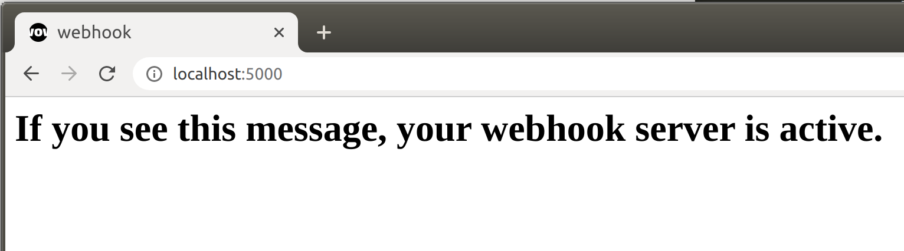

# ONDEWO NLU Webhook Server Python

## Introduction

This repository contains a template to create a webhook server. The server is set up to receive json-formatted POST
messages from `ondewo-nlu-cai` when an intent is matched for which the webhook call is activated.

An example use-case would be a database query for parameter values, which are then sent back to `ondewo-nlu-cai`, or
overwriting specific responses when a certain intent is active.

There are 2 cases for which the webhook call can be activated:

- slot filling

- response refinement

For details on these cases and integration of custom code, refer to the section on **custom code** below.

## Requirements / Packages

### prerequisites

To install the required python-packages, use:

> pip install --no-cache-dir -r requirements.txt

or for ddevelopment

> make setup_developer_environment_locally

### a note on testing

The tests are conducted by containerizing the server and sending test requests to it. Apart from the python
packages, `docker` and `docker-compose` need to be available, as well as the `docker` python sdk.

> pytest
>
> requests
>
> docker (python sdk)

## How to start the Server

### SSL Certificates

The webhook server is built to be deployed using SSL. The certificate files `cert.pem` and `key.pem` need to be provided
in the folder `/src/certificates`.

A `Makefile` is included in the repository to generate self-signed certificates sufficient for local deployment. To
generate them run the command `make create_ssl_certificates` in the repository's root directory.

### Docker

The easiest way to deploy the server is `docker`. A ready-to-use Dockerfile as well as `docker-compose.yaml` is provided
in the repo.

To start the docker image, run:

> docker-compose up

This will deploy the server in a docker container at https://127.0.0.1:5678.

### Local deploy

`/src/webhook_server.py` contains the code for the server. (Local) deployment of the server can be done with `gunicorn`:

> gunicorn -b 0.0.0.0:5678 src.webhook_server:app

To activate debugging set the  `--log-level=debug` flag.

> gunicorn -b 0.0.0.0:5678 --log-level=debug src.webhook_server:app

This will deploy the server to http://localhost:5678 (or http://127.0.0.1:5678).

A self-signed SSL certificate is provided in the home folder. To deploy with SSL use:

> gunicorn --log-level=debug --certfile ./cert.pem --keyfile ./key.pem -b 0.0.0.0:5678 src.webhook_server:app

This will deploy the server to https://localhost:5678 (or https://127.0.0.1:5678):

**possible but not recommended**:

If `python webhook_server.py` is called it will use the server included in the flask package to start the server
locally, which is useful for debugging. Debug mode will be active. The same thing can be achieved like this:

> export FLASK_APP=webhook_server.py
>
> export FLASK_ENV=develop
>
> flask run

## Deploy to public IP address

For quickly streaming the local server to a public IP, `ngrok` can be used.

How to install on Linux: https://dashboard.ngrok.com/get-started/setup

When `ngrok` is installed, run this for the unencrypted local server:

> ./ngrok http 5678

or this command for SSL-encrypted local server:

> ./ngrok http https://localhost:5678

This will stream the local server deployment to a randomly-generated public address. Note that ngrok is used in free
mode.

## Testing: server deployment and function

`tests/test_webhook_server.py` tests whether a connection to the webhook server can be established and whether the
response matches the expected format. The server is automatically deployed with `docker` (build+run) when the tests are
run. After a successful run the container is closed and the images are deleted.

1) `test_server_connection` sends a http GET message to the server and waits for a response

2) `test_custom_code("slot_filling")` tests the slot filling functionality by sending a sample POST request to the
   server. The return value of the **CUSTOM_CODE.py** function `slot_filling()` is validated.
   url: https://localhost:5678/slot_filling

3) `test_custom_code("response_refinement")` tests the response refinement functionality in the same manner as slot
   filling - the return value of the **CUSTOM_CODE.py** function `response_refinement()` is validated.
   url: https://localhost:5678/response_refinement

## Custom Code Integration

Custom code can be added to **CUSTOM_CODE.py**.

All intents for which the webhook call is activated need to be listed in `active_intents` at the top of the file. Either
the `displayName` or the `intent ID` can be specified. Both `slot_filling()` and `response_refinement()` will not be
called if the intent name is not found in the list. In this case the request message will be relayed back without
changes, with the relevant fields of the request copied to the response.

There are different functionalities available depending on the call:

### slot filling

Slot filling is called by `ondewo-cai` when a webhook call as well as slot filling is activated for a matched intent.
The goal is to supply `ondewo-cai` with parameter values and additional context information (or context deletion). The
POST message is sent to `[server-IP]/slot_filling`

The following functionality is available in `slot_filling()` in **CUSTOM_CODE.py**:

- changes to parameter values (global or context-specific)

- changes to active contexts

### response refinement

Response refinement is called by `ondewo-cai` when a webhook call is activated for a matched intent. The goal is to have
a last chance at changing the fulfillment messages that were generated by `ondewo-cai`. The POST message is sent
to `[server-IP]/response_refinement`.

The following functionality is available in `response_refinement()` in **CUSTOM_CODE.py**:

- changes to fulfillment messages (changes, deletions, additions)

Information about active contexts and parameter values are supplied to the function, but they cannot be changed here.

### validation

After running either `slot_filling()` or `response_refinement()`, the response message is constructed from the returns
and then validated. If validation fails, a `ValidationError` will be raised. It is advisable to test code
implementations in `slot_filling()` and `response_refinement()` by running the tests in `tests/test_webhook_server.py`
